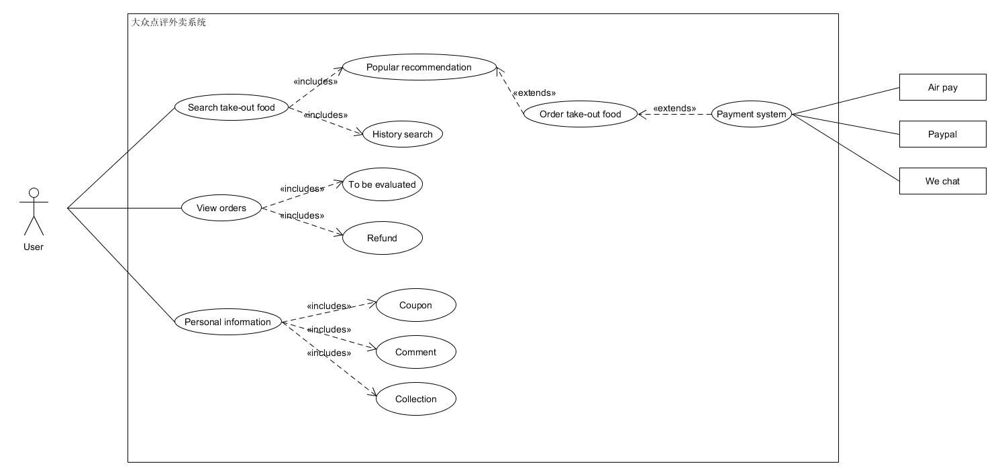

# Homework4

### ——16340312 周泽昊

#### 简答题

* 用例的概念
  * 用例是一种对系统如何反应外界请求的描述，通常通过用户的使用场景来获取需求
  * 每个用例提供了一个或多个场景，该场景说明了系统是如何和最终用户或其它系统互动，也就是谁可以用系统做什么，从而获得一个明确的业务目标
  * 用例建模主要是写文本的行为，而非画图

* 用例和场景的关系？什么是主场景或 happy path？
  * **关系**：一个用例代表了场景的集合，包含主场景和一些可选场景。其中场景是指使用场景，用来说明系统可以做什么，系统是如何和用户或其他系统交互的，从而获得一个明确的业务目标。
  * **主场景**：也被称为 happy path，主场景相当于主要的系统交互，即成功场景。

* 用例有哪些形式？
  * Brief（high level）：通常是简短的一段总结，描述主场景，在早起需求中可以快速了解主题和范围，方便快速创建。
  * Casual（简便格式）：非正式的段落形式，使用多个段落包含多个场景
  * Fully：所有的步骤和变化都写得很详细，并有支持部分，如先决条件和成功的保证。

* 对于复杂业务，为什么编制完整用例非常难？
  * 复杂的业务本身业务流程就很复杂繁琐，而且涉及到的场景非常多，很难将所有的目标、故事、使用场景遵循一定的顺序列举出来。如果场景不够全面，那么用例的完整性就难以保障。

* 什么是用例图？
  * 用例图是指由参与者（Actor）、用例（Use Case），边界以及它们之间的关系构成的用于描述系统功能的视图，也是外部用户所能观察到的系统功能的模型图。

* 用例图的基本符号与元素？
  * **椭圆** ：表示每个用例
  * **矩形框** ：表示整个系统
  * **连线** ：表示参与者与用例之间的交互
  * **人** ：参与者
  * **箭头** ：用例之间的包含关系<includes>/扩展关系<extends>/泛化关系(箭头为三角)

* 用例图的画法与步骤
  * 确定系统边界
  * 确定参与者：如谁将使用该系统的主要功能、谁将需要该系统的支持以完成其工作、谁将需要维护、管理该系统，以及保持该系统处于工作状态等。
  * 识别用例：如特定参与者希望系统提供什么功能、系统是否存储和检索信息，如果是，由哪个参与者触发、当系统改变状态时，是否通知参与者、是否存在影响系统的外部事件等。
  * 确定用例间的关系：如包含关系、扩展关系和泛化关系。应用这些关系的目的是为了从系统中抽取出公共行为和其变体。
  * 确定关联的外部支持系统，放在系统框右边。

* 用例图给利益相关人与开发者的价值有哪些？

  * 每个用例制定了系统提供给客户的有用功能单元，使得客户可以更加清晰地看到系统的用途

  * 用例图能够使产品和工程师很清晰地看到系统的各个模块、各部分功能之间的关系、整个系统架构以及对于其他功能的依赖

#### 建模练习题（用例模型）

* 选择2-3个你熟悉的类似业务的在线服务系统（或移动 APP），如定旅馆（携程、去哪儿等）、定电影票、背单词APP等，分别绘制它们用例图。并满足以下要求：
  * 请使用用户的视角，描述用户目标或系统提供的服务
  * 粒度达到子用例级别，并用 include 和 exclude 关联它们
  * 请用色彩标注出你认为创新（区别于竞争对手的）用例或子用例
  * 尽可能识别外部系统和服务

* 

* 

* 然后，回答下列问题：

  * 为什么相似系统的用例图是相似的？

    * 因为相似系统的主要业务逻辑类似，用户需求也相似，因此用例的类型基本一致。

  * 如何利用用例图定位创新思路（业务创新、或技术创新、或商业模式创新）在系统中的作用

    * 在用例图中对创新用例使用某种颜色进行高亮标记。可以很方便地让需求方、开发人员快速了解该系统的创新功能，以及该模块相关依赖和输入输出结果。

  * 请使用 SCRUM 方法，选择一个用例图，编制某定旅馆开发的需求（backlog）开发计划表

    

    |ID|Name|Imp|Est(man-day)|How to demo|Note|
    |:---|:--:|:--:|:--:|:--:|---:|
    |1|注册|10|10|点击注册按钮，输入手机号、注册密码，获取验证码，正确填写验证码显示注册成功并跳转到app首页。下次能使用相同的手机号和密码正确登录。|需要短信服务支持。|
    |2|登陆|10|10|点击登录，输入正确的手机号和密码（或验证码），看到程序首页。||
    |3|查询酒店|50|30|选择位置、日期，输入特征关键词，选择价格区间和酒店档次，选择酒店类型后，能够返回符合检索条件的酒店列表。|位置需要GPS服务支持。特征关键词有联想和推荐。|
    |4|预定|70|30|在酒店列表中选择酒店跳转到酒店详情显示不同房型，选择房型后跳转到付款页面，此页面可以选择保险。点击预订后，付款并生成订单，手机收到预定成功短信。||

  * 根据任务3，参考 使用用例点估算软件成本，给出项目用例点的估算

    | 用例     | 事务 | 计算 | 原因                                     | UC权重 |
    | -------- | ---- | ---- | ---------------------------------------- | ------ |
    | 注册     | 4    | 2    | 查看手机号是否被注册过，验证验证码正确性 | 10     |
    | 登陆     | 3    | 2    |                                          | 5      |
    | 查询酒店 | 2    | 6    | 根据条件检索                             | 5      |
    |预定酒店|5|3||10|
